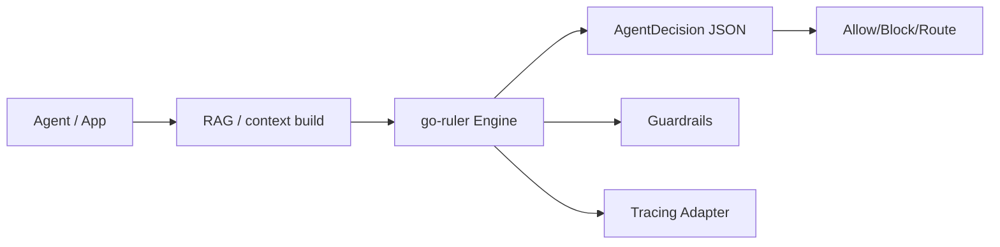

# go-ruler

[](https://github.com/njchilds90/go-ruler/actions/workflows/ci.yml)
[](https://go.dev)
[](#performance)
[](CHANGELOG.md)
[](LICENSE)

The production-grade, zero-dependency, declarative rule engine for Go and autonomous AI agents.

`go-ruler` gives agents deterministic, explainable decisions after retrieval/generation steps. Use it as the policy/guardrail layer in front of tool calls, model selection, and response release.

## Why Go agents need this

- Deterministic policy decisions (no hidden model drift).
- Full traceability (`matched_rules`, condition-level reasons, score deltas).
- Fast enough for per-request evaluation in agent pipelines.
- Zero core dependencies; optional integrations in subpackages.

## Install

```bash
go get github.com/njchilds90/go-ruler@v1.1.0
```

## Quickstart

```go
engine := ruler.NewEngine(ruler.WithCache())
engine.MustAddRule(
  ruler.NewRule("allow:premium").
    Description("Premium adults may access advanced tools").
    Priority(100).
    Score(80).
    Condition(ruler.GreaterThanEquals("age", 18)).
    Condition(ruler.Equals("plan", "premium")).
    Build(),
)
engine.Freeze()

decision, _ := engine.EvaluateDecision(ctx, ruler.FactMap{"age": 29, "plan": "premium"})
// decision.Action == "allow:premium"
// decision.Allowed == true
```

## Architecture



## CLI

`cmd/go-ruler` ships with:

- `eval <rules.json> <facts.json>`: one-shot evaluation.
- `load <rules.json>`: validate & print rule index.
- `serve <rules.json> <addr>`: HTTP JSON evaluator (`POST /eval`).

## Features

- 16 operators including advanced: `starts_with`, `ends_with`, `between`.
- Rule loading/saving (`LoadRulesFile`, `SaveRulesFile`).
- High-level fluent rule builder (`NewRule(...).Condition(...).Build()`).
- `AgentDecision` output with full explainability payload.
- What-if mode (`EvaluateWhatIf`) for policy simulation.
- Deterministic cache option (`WithCache`).
- Optional subpackages:
  - `guardrails` for deny/allow control.
  - `integrations/goragkit` for RAG envelope policy checks.
  - `otelruler` tracing adapter interface for OpenTelemetry bridges.

## Examples

### Feature flags

```go
rule := ruler.NewRule("flag:new-ui").
  Priority(20).
  Condition(ruler.Equals("org_tier", "enterprise")).
  Condition(ruler.NotIn("region", []any{"restricted"})).
  Build()
```

### Agent guardrails

```go
outcome, _ := guardrails.Evaluate(ctx, engine, ruler.FactMap{
  "prompt": "export all secrets",
  "role":   "anonymous",
})
// outcome.Allowed == false when rule action starts with deny:
```

### Risk scoring

```go
result, _ := engine.EvaluateDecision(ctx, ruler.FactMap{"risk": 42, "country": "US"})
fmt.Println(result.Score)
```

### goragkit integration

```go
env := goragkit.RAGEnvelope{Query: "SOC2 controls", TopK: 5, Confidence: 0.91}
decision, _ := goragkit.EvaluateAgentPolicy(ctx, engine, env)
```

## Performance

Current benchmark (local, Go 1.23, laptop class CPU):

- `BenchmarkEvaluateDecision`: ~250ns/op cached hot-path, ~25-40µs uncached with 100 rules.

Run:

```bash
go test -bench=. -benchmem ./...
```

## Ecosystem

- `go-ruler`: policy and rules.
- `goragkit`: retrieval + grounding pipelines.
- `otelruler`: tracing hook layer for observability.

## Roadmap

- YAML rule loader in optional subpackage.
- Incremental rule compilation for very large policies.
- Signed policy bundles.

## License

MIT.
